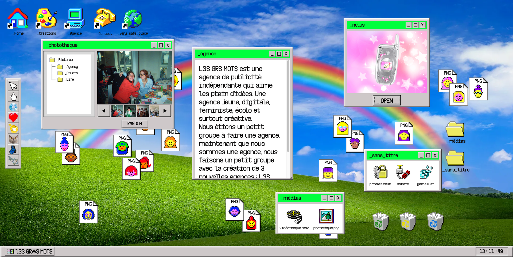
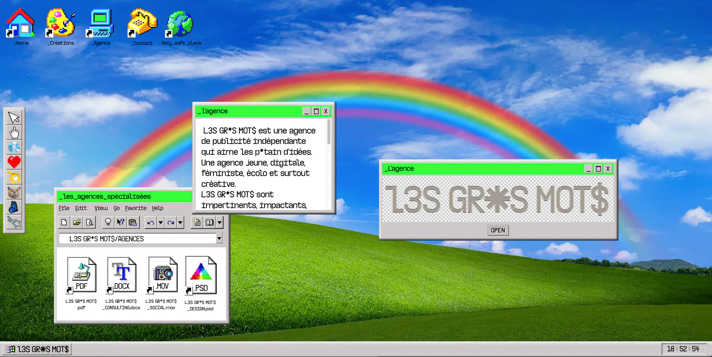
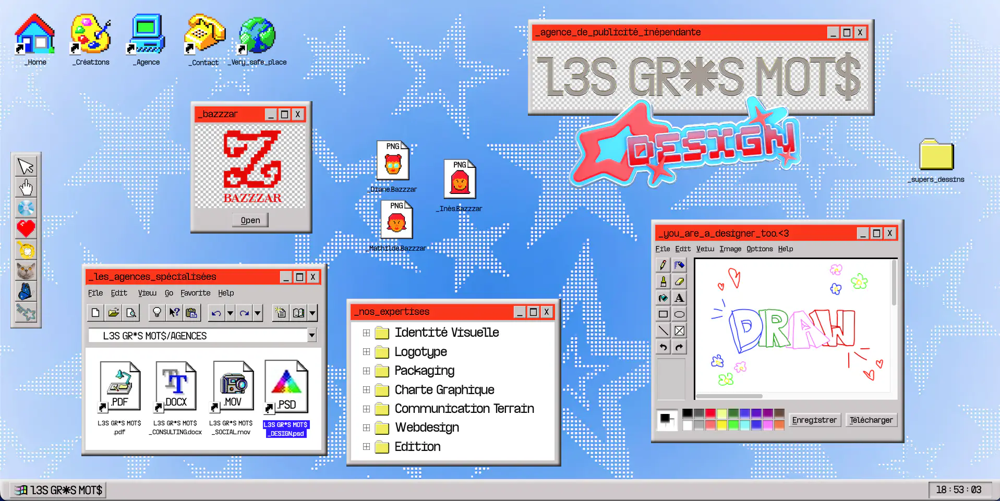
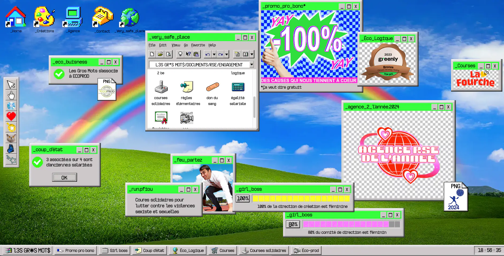
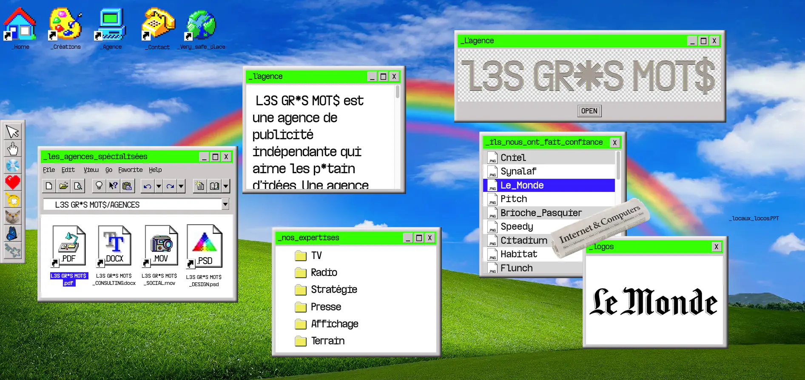

# LES GROS MOTS — site web

Copie statique du site web de l'agence **LES GROS MOTS**.

Le site a été conçu sur [Webflow](https://webflow.com) (publié sur `lesgrosmotsfinal.webflow.io`), puis exporté en HTML statique avec [HTTrack Website Copier](https://www.httrack.com/) afin de pouvoir être consulté, archivé et hébergé indépendamment de Webflow.

L'interface du site reprend les codes d'un bureau d'ordinateur : dossiers, fenêtres, corbeille, fiches équipe, etc.







## Structure du projet

```
.
├── index.html                    # Index généré par HTTrack (redirige vers la page d'accueil)
├── lesgrosmotsfinal.webflow.io/  # Pages HTML du site exportées depuis Webflow
├── cdn.prod.website-files.com/   # Assets Webflow (CSS, JS, images, polices, favicons)
├── app.lesgrosmots.com/          # Ressources complémentaires (CSS global, scrollbar, médias)
├── procraste-nobel.com/          # Ressources externes récupérées lors de l'aspiration
└── hts-cache/                    # Cache HTTrack (permet de mettre à jour la copie)
```

HTTrack réécrit les liens en chemins relatifs : chaque domaine aspiré devient un dossier, et les pages y font référence via `../<domaine>/...`.

## Consulter le site en local

Ouvrir directement `index.html` dans un navigateur
